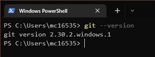

# Git

Git is a version control system which saves multiple versions of a file, or many files within a folder (or directory), to track changes that you make. It started out as a tool to track the development of the Linux kernel source code, and has a reputation for use in software development, but it can (and I recommend that it should!) be used to track any kind of files:
- Papers / theses
- Project / course work
- Data from experiments

This tutorial is aimed at Windows users, however the only part this directly affects is installation. Everything else will work the same.

## Installation

To get started, [download](https://git-scm.com/download) and install the appropriate version of Git. Get to a point where you can open a command window and type `git --version` and get a response back.

From here, you can either continue to use the command line, or launch Git Bash

## Configuration

For personal use, there isn't much need to do any configuration as any actions made to keep track of changes to files will be performed by a single user. This information is stored locally and will remain private at this stage, and will not be shared unless you decide to use a backup service such as GitHub or GitLab. When working on larger projects or collaborations, having identifying information is very important to track who is making which changes.

Set your name using
`git config --global user.name <Your name>`
and your email address using
`git config --global user.email <your_email>`

You will also need to set a text editor. You can make use of command line editors such as `nano` or `vim`, and on Windows you can use an external application such as Notepad or Notepad++, however to do this you will need to provide the full path to the .exe file.
`git config --global core.editor <preferred editor>`