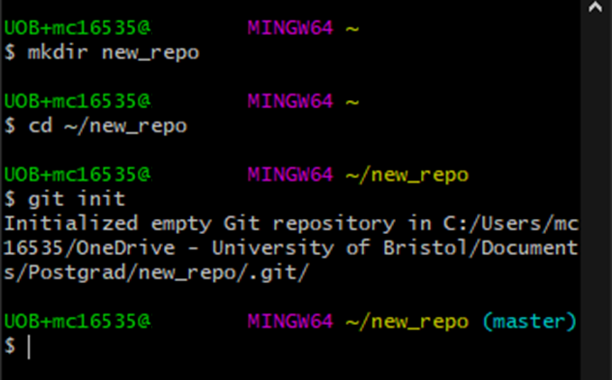

# Initialise a Repository

Git works by saving content within a directory, essentially taking a snapshot of the current state of all of the files inside the directory. Make a new directory either in the file explorer or using `mkdir` from the command line, and navigate into it:
`cd <path>`

Now we need to initialise a repository with Git. A repository, or "repo", is the name for this folder which will be managed by Git. To do this, use
`git init`
inside the space. We have now initialised an empty repository, and can now tell Git to start tracking files.

Note that Git Bash now has the name `(master)` next to the directory `~/new_repo`. This indicates that the repo was set up successfully inside this directory.