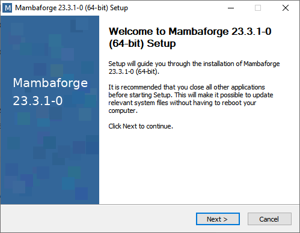
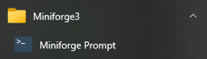
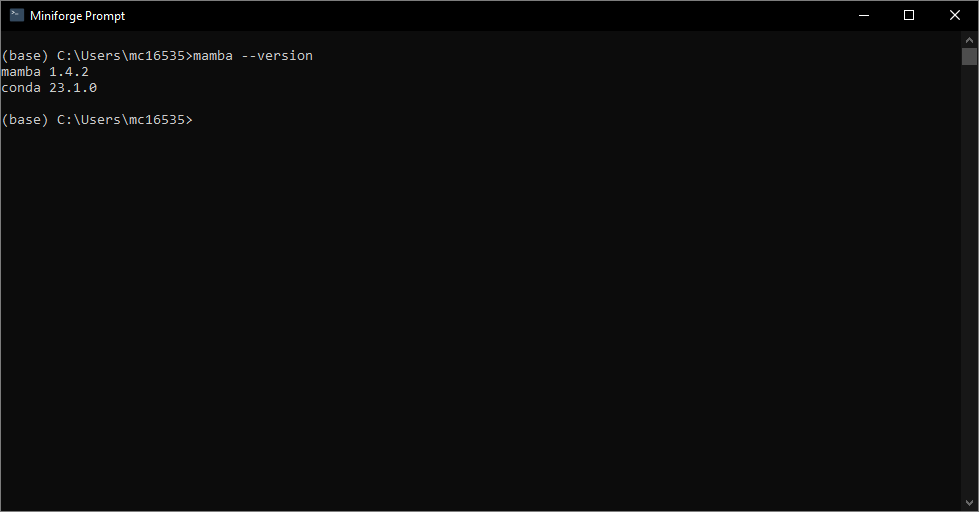

# Mamba

[Mamba](https://mamba.readthedocs.io/en/latest/index.html) is a package manager which is useful for those looking for an alternative to Conda / Anaconda for their Python environment manager needs. Anaconda is a set of packages designed to be stable for data scientists, engineers, etc, with the package manager Conda and GUI Anaconda Navigator, however I have found that this stability comes at the expense of frequent updates. This has caused me a whole host of problems, so I moved to Mamba and recommend you do too!

## Installation

Install the appropriate [mambaforge](https://github.com/conda-forge/miniforge#mambaforge) file and run it.

After installation, run the program `Miniforge Prompt`. Verify that it has installed correctly using command `mamba --version`.

